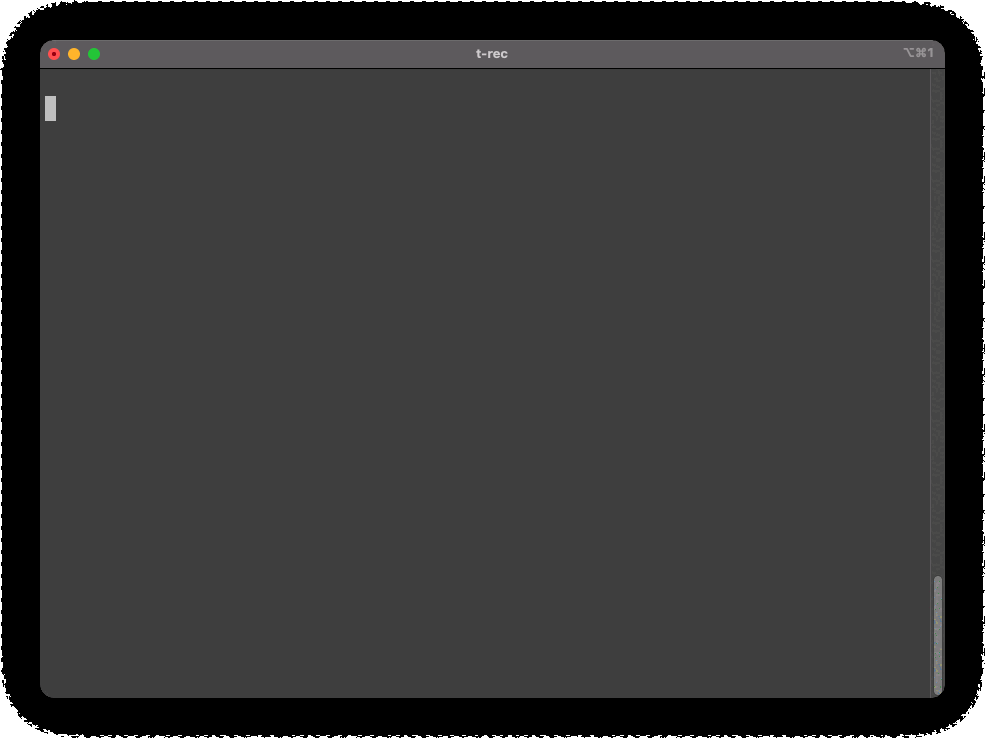

# dcq - Docker Compose Quick



日本語 README は[こちら](./doc/README_ja.md)です。

- This command line tool provides you with a Dockerfile and docker-compose.yml to select and launch.
- This tool will create the following directories.
  - context/app_name = Dockerfile and the location of the various contexts.
  - volumes/app_name = A place to mount local files on your PC for development purposes.
    - It is preferable to keep the actual development code in a separate repository with symbolic links, etc.

## Requirements

Please install these components beforehand.

- docker
- docker-compose
- ghq
- fzf

## Install

IMPORTANT: Be sure to `ghq get` this repository first.

Load `scrpts/dcq.sh` with the `source` command.

(sample code)

```bash
echo "source $(ghq list -p dcq)/scrpts/dcq.sh" >> ~/.zshrc
```

- If you are using `bash`, change `.zshrc` to `.bashrc`.

## Usage

```bash
dcq <command> <app_name>
```

## Commands

(Excluding `list`)If no `app_name` is specified as an argument, a selective list will be displayed.

| commans           | example                   | description                                                          |
| ----------------- | ------------------------- | -------------------------------------------------------------------- |
| `c` (or `create`) | `dcq c myapp`             | create empty `Dockerfile`,`docker-compose.yml`, and any directories. |
| `u` (or `up`)     | `dcq u` or `dcq u django` | docker-compose up with detach                                        |
| `d` (or `down`)   | `dcq d` or `dcq d django` | docker-compose down                                                  |
| `l` (or `list`)   | `dcq l`                   | list all app_name                                                    |

## Sample Files

The following files are stored in this repository as samples.

- [Django](https://docs.djangoproject.com/) (with the database disabled)
- [Serverless Framework](https://www.serverless.com/framework/)
