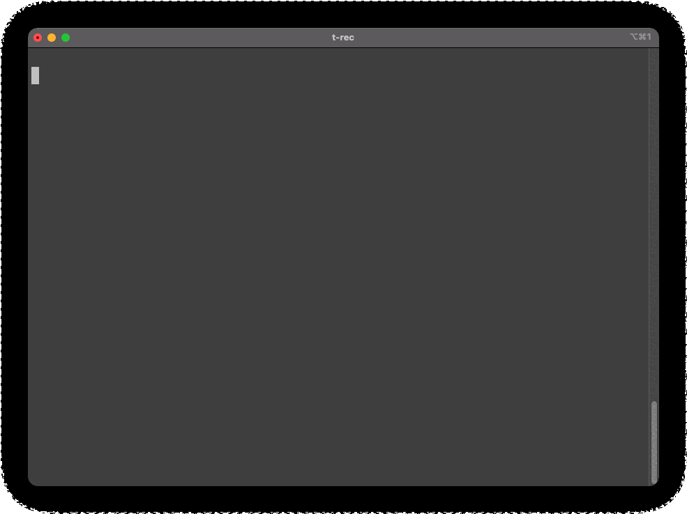

# dcq - Docker Compose Quick



English README is [here](../README.md).

- Dockerfile と docker-compose を選択して起動する CLI ツールです。
- このツールは以下のディレクトリを作成します。
  - context/app_name = Dockerfile や各種コンテキストファイルの格納場所
  - volumes/app_name = ローカル PC のディレクトリをマウントする場所
    - 実際の開発においてはシンボリックリンクなどで対応して実体を別で Git 管理にすると良いでしょう。

## 必要なもの

事前に下記をインストールしておいてください。

- docker
- docker-compose
- ghq
- fzf

## インストール方法

重要: 必ず最初に `ghq get` を用いて、GitHub からこのリポジトリをクローンしてください。

その後、シェル起動時に常時 `scrpts/dcq.sh` を `source` を用いて読ませるようにします。

(サンプルコード)

```bash
echo "source $(ghq list -p dcq)/scrpts/dcq.sh" >> ~/.zshrc
```

- `bash` をお使いの場合は `.zshrc` を `.bashrc`に変更してください。

## 使い方

```bash
dcq <command> <app_name>
```

## Commands

(`list`以外)`app_name` を引数に渡していない場合、選択式のリストが表示されます。

| commans           | example                   | description                                                                |
| ----------------- | ------------------------- | -------------------------------------------------------------------------- |
| `l` (or `list`)   | `dcq l`                   | 存在する app_name 一覧を表示します                                         |
| `c` (or `create`) | `dcq c myapp`             | 空の `Dockerfile`,`docker-compose.yml`, および各種ディレクトリを作成します |
| `u` (or `up`)     | `dcq u` or `dcq u django` | docker-compose up をデタッチモードで実行します                             |
| `s` (or `shell`)  | `dcq s` or `dcq s django` | シェルを起動しますう                                                       |
| `d` (or `down`)   | `dcq d` or `dcq d django` | docker-compose down を実行します                                           |

## サンプルファイル

いくつかサンプルを用意しています。

- [Django](https://docs.djangoproject.com/) (DB 定義は無効化)
- [Serverless Framework](https://www.serverless.com/framework/)
